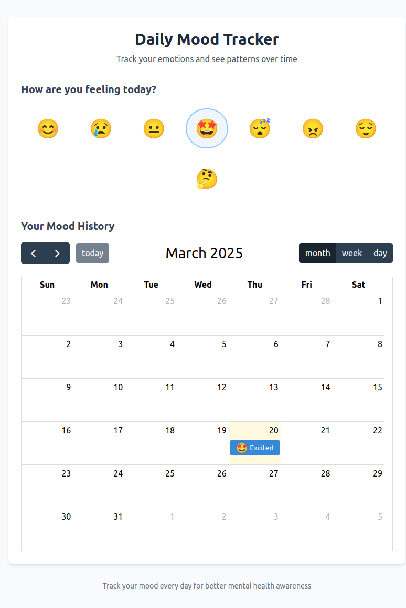
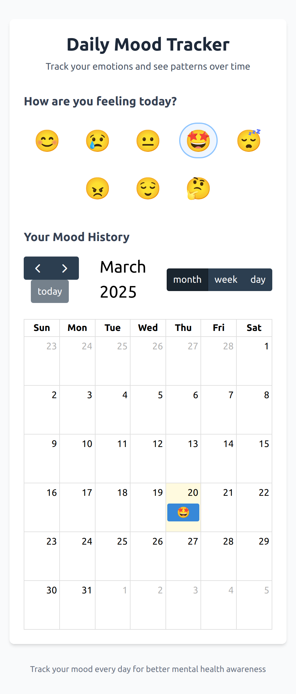

# Mood Tracker:

A simple web application that tracks moods on a daily basis.

## Features:

- **Add Mood**: Add your mood on daily basis and anlayse them over weeks/months.

## Screenshots:

### Web-Page:

### Mobile-Page:

## Deployment Link:

You can access the live version of the app here:  
[Mood Tracker](https://moodtrackerr.netlify.app/)

## Technologies Used:

- HTML, CSS, and JavaScript for the front-end
- LocalStorage API for storing moods.
- FullCalender Package for calender management.
